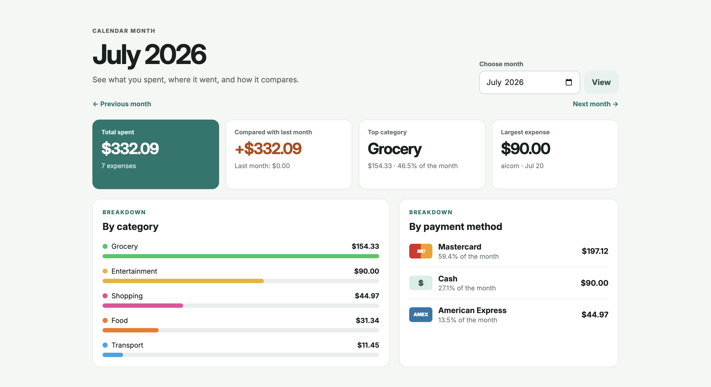
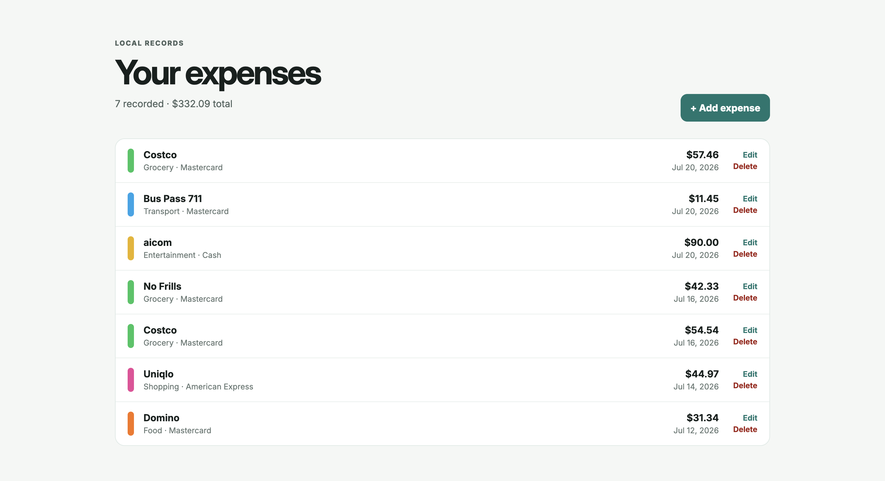
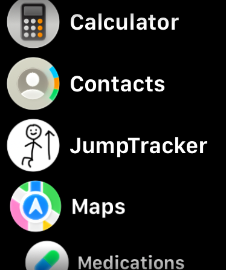
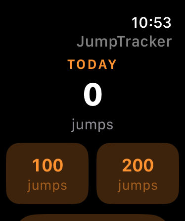

  <h1>Yirong Wang</h1>
  
<em>Software Developer · Winnipeg, Canada · She/Her</em>

  

    <a href="https://www.linkedin.com/in/yirongwangcs">LinkedIn</a>
    &nbsp;·&nbsp;
    <a href="https://github.com/YirongW0">GitHub</a>
  

## About

Hey, I am Yirong. I enjoy learning new technologies by building things I actually need and want to keep using for a long time.

Most of my projects start with a problem I run into myself. I like turning those ideas into useful tools and improving them as I keep using them.

## Background

I studied Computer Science at the University of Manitoba and previously worked as a Software Development Engineer at AWS. I mainly worked on monitoring dashboards and metrics, along with solving production and product issues as they came up.

I am always experimenting, learning, and trying to build software that is useful enough to stick around.

## Technical Profile

  <strong>Languages</strong> 
  Python · TypeScript · Java · JavaScript · C# · C/C++

  <strong>Tools and Technologies</strong> 
  React · AWS · SQL · Git · Figma · Jira · .NET · Node.js · Flask

  <strong>Current Focus</strong> 
  Learning new technologies and building practical tools for everyday use

## Recent Projects

### Expense Tracker

A local expense tracker I am building with C# and .NET to make understanding my spending easier. It lets me add and manage expenses, compare different months, and view breakdowns by category and payment method.

  
  

### JumpTracker

A simple Apple Watch app for recording jumps during a workout. The main screen shows the daily total and provides quick preset buttons so recording jumps takes only a tap.

<table>
  <tr>
    <td align="center" width="50%">
       
      JumpTracker in the app list
    </td>
    <td align="center" width="50%">
       
      Today’s jump count
    </td>
  </tr>
</table>

